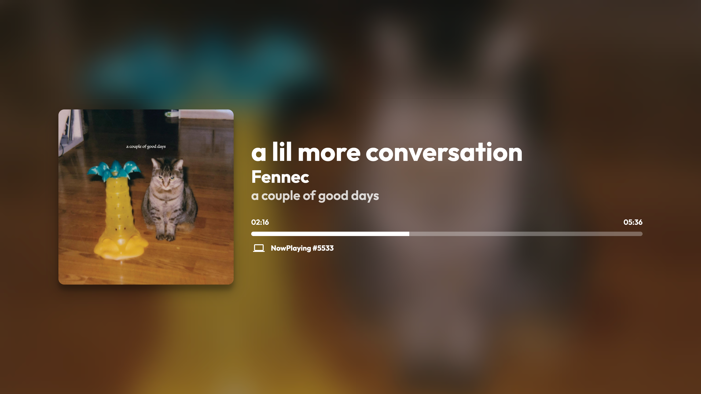
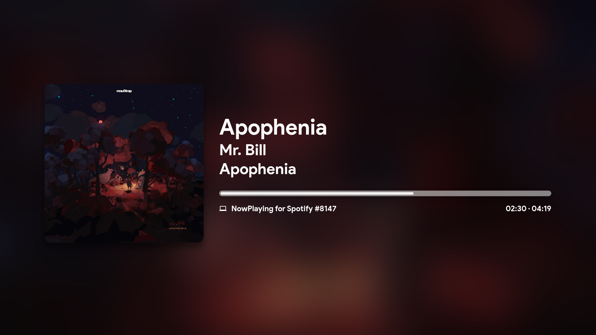

# NowPlaying for Spotify

This is a real-time updating Spotify Connect visualizer, which has had its base codebase made in half a day.

This project is licensed under GNU GPL-3.0 license.

---

Available at [nowplayi.ng](https://nowplayi.ng)

Try the ongoing AlpineJS rewrite at [dev.nowplayi.ng](https://dev.nowplayi.ng)!

[Status page](https://uptime.busybox.colabois.fr/status/nowplaying)

###### Dedicated Discord server: [nowplayi.ng/discord](https://nowplayi.ng/discord) - tip to me: [paypal.me/busybox11](https://paypal.me/busybox11) (thank you!)

## **Changelog**

v1.6.X
- Use of localStorage
- Added GNU GPL-3.0 license
- Updated Index page design 
- Updated French and English sentences 
- Compatibility with Dark Reader
- Better UI consistency / CSS tweaks
- More languages
- .env support (thanks @finnie2006!)

<details>
  <summary>v1.5.X</summary>
  
    - Added playback support (Premium account should be needed)
    - Added playback information
    - Added pause button (#17)
    - CSS improvements added for better responsive (#15 #16)
    - SEO improvements (#16)
    - Minor CSS improvements
</details>

<details>
  <summary>v1.4.X</summary>
  
    - Advertisements are recognized
    - Multiple artists are recognized
    - Experimental theme switcher
</details>

<details>
  <summary>v1.3.X</summary>
  
    - Now playing device name and type is showing
    - Cursor is hidden after a couple of seconds
    - Fullscreen button
</details>


*Regular theme*


*New theme*

## **Coded in:**

HTML, CSS, JS, PHP

## **Used libraries:**

[Spotify Web API PHP by jwilsson](https://github.com/jwilsson/spotify-web-api-php) to obtain the token and refresh token,
[Spotify Web API JS by JMPerez](https://github.com/jmperez/spotify-web-api-js) to retrieve and display the currently playing song

## **Known bugs**

- [ ] Podcasts aren't recognized
- [X] ~~White flash when loading new artwork~~

## **Upcoming changes**

- [ ] Rewrite (see [discussion #76](https://github.com/busybox11/NowPlaying-for-Spotify/discussions/76) about the possible use of web frameworks)
- [ ] OBS source (In progress!)
- [ ] Local players support (coming with [localmusic-api](https://github.com/busybox11/localmusic-api/projects) - [Sunamu by @NyaomiDEV](https://github.com/NyaomiDEV/Sunamu))
- [X] ~~Better config handling (e.g. automatic deployment, **HELP WANTED!**)~~
- [ ] Themes (experimental theme / theme switcher since v1.4.3)
- [ 
## **Feature ideas**

- Analytics panel] Chromecast integration

## **How to host this?**

You can use XAMPP (multi-platform) or Wampserver (Windows only) but any webserver with PHP 7.0 or greater is good to use, with the `php-curl` module.

**!!! If you are on Nginx you need to add this to your config, or else your .env will be exposed to the internet !!!**
```
location /.env {
    allow [YourIP]; # Allow your IP if you want to, if not delete this line.
    deny all;
}
```

## **What modifications are required?**

You should have a declared app in Spotify's developer dashboard to obtain a `Client ID`.

*How to do this:*
As I said, the first thing is to create a Client ID (`Create a Client ID` button) on [Spotify's developer dashboard](https://developer.spotify.com/dashboard/applications).
Type your app's name in the `App or Hardware name` text field, and its description on the `App or Hardware description` text field. In the `What are you building ?` section, indicate the platform which you are building the app for, then click on the `NEXT` button. Answer to the commercial integration question, and continue. If necessary, fill the form and check all the boxes at the 3rd stage and you're ready to go. Your app is declared in Spotify's developer dashboard!

Now that you have your app, you have some modifications to do in one file: `.env`.
(If it doesn't exist, copy `example.env` to `.env`)

Edit those values:

- `YOUR_CLIENT_ID` by your Client ID available on your app's panel,
- `YOUR_CLIENT_SECRET` by your `Client Secret` available by clicking on the `Show Client Secret` button situated on the same webpage as your client ID,
- `YOUR_DOMAIN` by your redirect URL, in the case of a local hosting replace it by `http://localhost/token.php` in most cases. Basicaly, it's the accessible URL for the `token.php` page.

Let's go back on our app's panel. You need to declare the URL where the `token.php` page is located, for a local hosting it would be in most cases `http://localhost/token.php`. Click on the green `Edit settings` button situated on the top of the page, then in the `Redirect URIs` text field, indicate yours. ***ATTENTION***: what you typed should **IMPERATIVELY** be the same as what you wrote in the two precedent files! Then click on the `SAVE` button on the very bottom of the form. Your app is declared and ready to use!

## **Credits**
Flags by [Freepik](https://www.freepik.com/) of the [www.flaticon.com](https://www.flaticon.com/) website under [Creative Commons BY 3.0](http://creativecommons.org/licenses/by/3.0/) license.

## **Featured similar projects / forks**
- [NowPlaying Dashboard for Spotify by @peterdconradie](https://github.com/peterdconradie/Now-Playing-Dashboard-for-Spotify)
- [MPRIS electron app by @AryToNeX](https://github.com/AryToNeX/nowplaying-electron)
